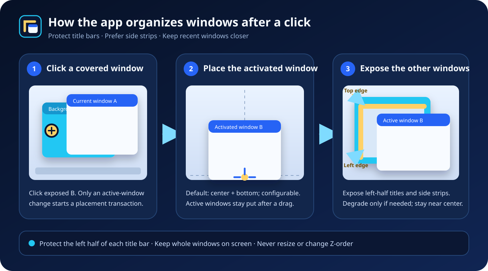

# Windows 11 Stage Manager-style Window Manager

**English** | [简体中文](README.zh-CN.md)

A system-tray utility that automatically organizes ordinary desktop windows. When you activate a background window, the app places it at your chosen position and arranges covered windows into a title-bar staircase so that every window retains two clickable edges. It **only moves windows** and never changes their size or Z-order.



## Quick start

1. Download the release archive `WindowsStageManager-<version>.zip` (or build it using the instructions below), extract it, and run `stage_manager.exe`.
2. The application stays in the system tray. Its defaults are:
   - `place_activated_window=true`: when a window changes from inactive to active, place it at the horizontally centered and bottom-aligned position (`activation_horizontal_alignment=1` and `activation_vertical_alignment=2`; any of the nine positions can be selected from the tray);
   - `affordance_preset=1` (Balanced): rearrange covered windows so two edges remain visible;
   - `dry_run=false`: apply the calculated moves (DryRun calculates and logs them without moving windows);
   - `ui_language=1`: use the English interface by default; Simplified Chinese remains available from Quick settings.
3. Press `Ctrl+Alt+F12` at any time to disable management immediately. Select **Enable management** from the tray menu to resume.

## What it does

### Place newly activated windows

- When an inactive window becomes active through a mouse click, the taskbar, Alt+Tab, or another normal activation path, its visible rectangle is moved to the configured position. Horizontal alignment can be Left, Center, or Right; vertical alignment can be Top, Center, or Bottom. The default is **Center + Bottom**. If the window is taller than the work area, its title bar stays aligned with the top of the work area.
- A window that is already active is not placed again. If you drag it, it remains where you leave it.
- A right click that activates a window or opens its context menu does not trigger automatic window movement, including while the menu opens, closes, and returns focus to the original window. Normal layout resumes after another ordinary window is activated.
- To keep newly activated windows in place, turn off **Place newly activated windows** under **Quick settings** in the tray menu. It can be turned back on at any time.

### Keep covered windows recognizable

- After an activation change or the end of a drag, the app creates one batch plan for up to 20 ordinary windows on the **same monitor**, validates it, and then applies it.
- It first exposes a top edge plus one side edge by building one deterministic staircase anchored to the active window. Background windows follow immutable Z-order, and every next window is placed 1.5 title-bar heights upward (rounded up to a whole pixel) and one side-depth to the left of the previous window, leaving the title bar comfortably visible. The solver tries the complete top-left chain first and switches the complete chain to top-right only when top-left cannot fit safely; one-edge left, right, and bottom chains are later fallbacks.
- The title-bar value controls the gap between adjacent staircase nodes, not the distance from a window's old position. This makes the final arrangement independent of where each background window happened to be before activation. A layout that already meets the selected visibility goal is left untouched, and there is no later visibility-area pass that can scatter the chain. Every resulting rectangle must remain fully inside the work area.
- When the 20-window management limit matters, directly covered peers are selected first; repeated windows with the same process and window class (for example, several File Explorer windows) are selected before single-instance types.
- Partial layouts protect higher, more recently used windows first; those windows do not move aside for lower windows. When there is no safe solution, no move is applied and a short **No window layout is currently available** notification appears. Repeated notifications are throttled, and the layout is retried after window state changes.

### Safety boundaries

- Window size and Z-order are never changed. A background window moved by the solver must remain fully inside its current monitor work area, and every batch verifies position and size after each move. A window larger than the work area is not moved merely to obtain a layout solution.
- After repeated snapshot or Window API failures (three by default), a circuit breaker disables management to avoid moving windows from stale state.
- The final position of a window you manually dragged takes precedence over automatic placement.

## Tray and settings

- Right-click the tray icon for **Pause/Enable management**, **Open visual settings...**, **Quick settings**, and **Exit**. Use **Interface language** under Quick settings to switch between Simplified Chinese and English; the choice takes effect immediately and is saved automatically.
- **Quick settings** contains the run mode (Apply window moves / Preview only (DryRun)), newly activated window placement, horizontal and vertical placement, recognizability presets (Compact/Balanced/Prominent), and 16 continuous values for the minimum length, maximum length, depth, and dynamic percentage of the top, left, right, and bottom edges. Continuous values include a **Custom...** option and show the current value in the menu.
- **Open visual settings...** provides localized names, units, valid ranges, and a live canvas preview of the clickable edges retained for each window. **Save and apply** takes effect immediately without restarting the application.
- Configuration and logs are stored automatically under `%LOCALAPPDATA%\WindowsStageManager` (`settings.ini` and `logs\manager.log`). Manual editing is not required. In DryRun mode, `batch_complete` log entries report planned moves (`planned_moves`) and the selected degradation level (`affordance_goal` and `affordance_goal_degraded`).

## Build and test

Requires CMake 3.25+, Ninja, Visual Studio 2022 C++, and the Windows 11 SDK:

```powershell
cmake --preset windows-debug
cmake --build --preset windows-debug
ctest --preset windows-debug --output-on-failure
```

Use the `windows-release` preset for a Release build. Every commit must pass Configure, Build, and CTest in both Debug and Release configurations.

## Stage a release

```powershell
powershell -NoProfile -ExecutionPolicy Bypass -File scripts\stage_release.ps1 `
  -BuildDirectory build\release -OutputDirectory artifacts\release `
  -Version 0.2.1 -Commit (git rev-parse --short HEAD)
```

This produces a versioned ZIP archive and `manifest.json`, updates `current.json`, and retains the previous release as `rollback.json`.

## Documentation

- [Software features (authoritative description of the current implementation)](docs/SOFTWARE_FEATURES.md)
- [Software design (architecture, algorithms, and handoff guide)](docs/SOFTWARE_DESIGN.md)

These two documents are maintained with the code. `SOFTWARE_FEATURES.md` defines the current functional boundary, and `SOFTWARE_DESIGN.md` describes the implementation and extension points. They are currently available in Simplified Chinese.
