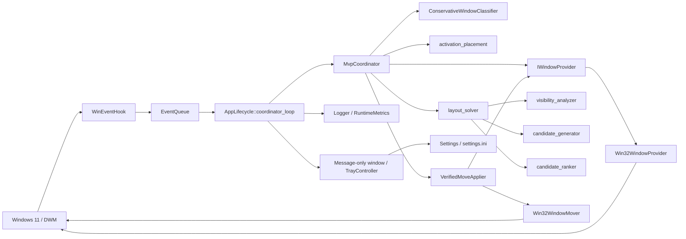

# Windows Stage Manager 软件设计文档

> 文档性质：当前代码架构与详细设计（As-built Design）
> 适用版本：0.2.1
> 更新日期：2026-09-06
> 配套文档：[软件功能说明](SOFTWARE_FEATURES.md)

## 1. 文档目标

本文面向后续开发者和 AI 编程代理，用于在尽量短的时间内建立对当前代码的正确认识，并安全地实现新功能。

本文重点回答：

- 程序由哪些模块组成，各模块的责任边界是什么；
- Win32 事件如何进入队列并最终转化为窗口移动；
- 窗口身份、快照、可管理性和遮挡关系如何表示；
- 激活放置、边缘可见性、候选生成、排序和降级如何协作；
- 多线程、事务、验证、熔断和日志如何保证安全；
- 新增设置、事件、求解规则或 Win32 能力时需要修改哪些位置；
- 哪些代码是当前运行路径，哪些只是保留但未接线的基础设施。

本文描述当前实现，不描述愿景。若本文与代码不一致，以代码和自动化测试为准，并应在同一个提交中修正文档。

## 2. 设计原则与系统边界

### 2.1 核心原则

当前实现遵循以下原则：

1. **用户操作优先**：真实拖动或缩放后的活动窗口位置不能被自动放置覆盖。
2. **位置优先、层级不变**：运行时只移动位置，不改变尺寸和 Z-order。
3. **保守管理**：身份、几何、桌面或样式信息不完整的窗口不作为移动目标。
4. **上层优先**：完整布局无解时，先保证 Z-order 更高的后台窗口可辨识。
5. **有界求解**：候选数、状态数、移动数、区域复杂度和时间均有限制。
6. **执行后验证**：每次 Win32 移动后重新抓取快照并验证，而不是相信 API 返回值。
7. **过期事务失效**：新交互、暂停或配置变更会取消旧移动事务。
8. **可观测**：每批处理记录结构化日志与累计指标。

### 2.2 当前边界

当前产品是 Windows 11、单用户交互桌面、单进程、单实例的托盘程序。它没有服务进程、驱动、内核组件、网络服务、数据库或第三方运行时依赖。

自动布局只针对活动窗口所在显示器，不跨显示器搬移窗口。安全桌面、提权窗口和更高完整性级别进程可能因 UIPI 或访问权限无法处理。

## 3. 构建产物与仓库结构

### 3.1 构建产物

| 目标 | 类型 | 说明 |
|---|---|---|
| `stage_manager_core` | 静态库 | 设置、几何、求解、窗口协调、诊断以及 Win32 平台实现 |
| `stage_manager` | Windows GUI EXE | 生命周期、消息窗口、托盘、设置对话框和资源 |
| `window_inspector` | 控制台工具 | 枚举并检查真实窗口快照和分类信息 |
| `scenario_runner` | 控制台工具 | 对确定性布局场景进行回归和性能比较 |
| `stage_manager_*_tests` | 测试程序 | 单元、性质、集成、Win32 桌面和发布测试 |

虽然名称是 `stage_manager_core`，该库目前直接编译 `src/platform/win32` 并链接 `user32`、`dwmapi`、`ole32`，因此它不是可移植核心。若未来支持其他平台，需要先重新拆分 CMake 目标和平台接口。

### 3.2 目录职责

| 目录 | 主要职责 |
|---|---|
| `src/app` | 进程生命周期、设置模型、托盘菜单、对话框、资源和版本 |
| `src/diagnostics` | 文本日志和线程安全运行指标 |
| `src/geometry` | 64 位矩形、区域布尔运算、DPI、工作区和交互边缘 |
| `src/solver` | 可见性分析、候选生成/排序、布局搜索和布局哈希 |
| `src/window` | 平台无关窗口快照、身份、分类、事件、事务、协调和移动验证 |
| `src/platform/win32` | WinEvent/鼠标钩子、窗口枚举、DWM 查询和 `SetWindowPos` |
| `src/tools` | 窗口检查与场景运行工具 |
| `tests` | 与各模块对应的测试和 PowerShell 集成测试 |
| `scripts` | 发布打包脚本 |
| `assets` | ICO、SVG 图标和中英文功能示意图；默认英文 `README.md` 引用 `feature-overview.en.svg`，`README.zh-CN.md` 引用 `feature-overview.svg` |
| `.github/workflows` | Windows 2022 + MSVC 的 CI 构建、测试和发版 |

## 4. 总体架构

### 4.1 组件关系



### 4.2 依赖方向

逻辑上的主要依赖方向是：

```text
app orchestration
    -> window coordination and ports
        -> solver
            -> geometry
        -> app::Settings
    -> platform::win32 implementations
    -> diagnostics
```

需要注意两个现实耦合：

- `window` 和 `solver` 直接使用 `app::Settings` 中的枚举与配置，设置模型不是纯 UI 层。
- `solver::LayoutSnapshot` 复用 `window::WindowKey`，而 `MvpCoordinator` 又依赖 solver；这是类型复用，不是运行时循环调用。

新增功能时应尽量沿现有接口扩展，避免让 `geometry` 或 `solver` 反向依赖 Win32 API。

## 5. 线程与同步设计

### 5.1 UI/消息线程

`AppLifecycle::run` 所在线程是主线程，负责：

- 创建单实例 mutex；
- 注册并创建 message-only window；
- 初始化托盘图标；
- 注册 `Ctrl+Alt+F12`；
- 处理托盘命令、设置对话框、显示器/DPI 消息和程序退出；
- 接收协调线程通过 `PostMessageW` 上报的运行状态。

`TrayController` 和设置对话框仅在该线程操作。配置发生变化时，主线程先停止窗口管理组件，修改并保存设置，再重建组件，因此协调线程不会与设置写入并发访问同一份 `settings_`。

### 5.2 钩子线程

`WinEventHook::start` 创建专用线程。该线程：

1. 创建消息队列；
2. 安装六组 `SetWinEventHook` 范围；
3. 安装 `WH_MOUSE_LL`；
4. 运行 `GetMessageW` 消息循环；
5. 把规范化后的 `WindowEvent` 推入 `EventQueue`。

WinEvent 回调通过静态 `registry_` 从 `HWINEVENTHOOK` 找到实例；低级鼠标回调通过 `mouse_hook_owner_` 找到实例。两者由 `registry_mutex_` 保护。

钩子线程不抓取完整快照、不求解、不移动窗口，回调应保持短小，避免 Windows 移除超时的低级钩子。

### 5.3 协调线程

`AppLifecycle::coordinator_loop` 是唯一执行分类、求解和移动事务的线程。循环行为：

1. 最多等待事件 50 ms；
2. 收到首个事件后等待合并窗口，实际等待上限为 100 ms；
3. 一次性排空队列；
4. 在定期 reconcile 到期时追加 `Reconcile` 事件；
5. 检测队列丢弃数，必要时追加 `HookError`；
6. 调用 `MvpCoordinator::process`；
7. 记录批次日志和指标；
8. 更新健康状态并向 UI 线程投递状态消息。

### 5.4 同步原语

| 对象 | 同步方式 |
|---|---|
| `EventQueue` | mutex + condition variable，有界容量 4096 |
| `enabled_`、`dry_run_`、`coordinator_stop_` | atomic |
| `CoordinatorHealthMonitor` | 内部 mutex |
| `Logger` | 内部 mutex，逐行 flush |
| `MoveTransactionGuard` | 内部 mutex |
| WinEvent 静态注册表 | `registry_mutex_` |

停止顺序是：设置停止标志、关闭事件队列、停止钩子线程、join 协调线程，然后按依赖逆序销毁对象。不要在仍可能回调时提前销毁队列或 provider。

## 6. 应用生命周期

### 6.1 启动

`wWinMain` 创建 `AppLifecycle` 并进入 `run`。启动步骤：

1. 获取 `Local\WindowsStageManager.SingleInstance` mutex；
2. 注册带应用图标的消息窗口类；
3. 创建 message-only window；
4. 加载 `%LOCALAPPDATA%\WindowsStageManager\settings.ini`；
5. 初始化日志并写 `application_start`；
6. 创建托盘图标；
7. 注册紧急快捷键；
8. 通过 `start_window_manager` 构造完整运行管线；
9. 进入主消息循环。

测试可通过 `WINDOWS_STAGE_MANAGER_TEST_INSTANCE_ID` 为 mutex 名增加经过校验的后缀，从而启动隔离实例。

### 6.2 运行组件装配

`start_window_manager` 按以下顺序创建对象：

```text
EventQueue
Win32WindowProvider
WindowIdentityTracker
TrackingWindowProvider
InternalMoveTracker
MoveTransactionGuard
MoveFailureTracker
Win32WindowMover
VerifiedMoveApplier
MvpCoordinator
WinEventHook
coordinator thread
```

这里使用显式 `unique_ptr` 组合，而不是依赖注入容器。接口 `IWindowProvider`、`IWindowMover`、`IMoveApplier` 和 `ISolverClock` 是主要测试替换点。

### 6.3 设置重载

托盘快速设置或可视化设置保存后，会完整停止并重建上述窗口管理管线。优点是配置切换边界清晰；代价是每次改单个参数也会重装事件钩子并清空稳定布局、身份代次和事务状态。

### 6.4 退出

托盘“退出”、`WM_CLOSE`、会话结束或进程析构都会停止窗口管理器、注销快捷键、删除托盘图标、销毁消息窗口并关闭日志。

## 7. 核心数据模型

### 7.1 窗口身份

`WindowKey` 由三部分组成：

```cpp
{ hwnd, processId, instanceGeneration }
```

只使用 HWND 不安全，因为 Windows 会复用句柄。`WindowIdentityTracker` 为首次观察到的 HWND/进程组合分配递增代次；收到 `Destroy` 时遗忘，收到 `HookError` 时清空全部身份。所有移动计划和验证都使用完整 `WindowKey`。

### 7.2 平台快照

`WindowSnapshot` 使用 32 位 `PixelRect` 保存 Win32 原始像素数据，主要字段包括：

- placement rect 与 DWM visual rect；
- monitor 与 work area；
- DPI 与标题栏高度；
- style、extended style、owner、root、class name；
- visible、iconic、zoomed、topmost、cloaked、current desktop；
- zIndex 和 `zOrderKnown`；
- `queryFailures` 位图；
- 分类后写入的 `managed`。

`WindowSnapshotBatch` 带单调递增版本、抓取原因、状态、Win32 错误码和 `complete` 标记。不完整批次不能进入布局求解。

### 7.3 求解快照

`solver::LayoutWindow` 把几何提升到 64 位 `geometry::Rect`，避免坐标加减溢出，并加入：

- `lastStableRect`：上次验证成功的稳定位置；
- `managed`：是否属于本批求解目标集合；
- `movable`：本轮是否允许移动；
- `blocksVisibility`：是否作为遮挡物；
- 只读的 zIndex、monitor、DPI、标题栏高度等。

`LayoutSnapshot` 是纯值对象，求解器通过复制快照模拟候选，不调用 Win32。

### 7.4 事件

`WindowEvent` 包含类型、HWND、来源线程、时间、序号和 `suppressLayout`。类型包括：

- `MoveSizeStart` / `MoveSizeEnd`；
- `Foreground`；
- `LocationChange`；
- `Show` / `Hide` / `Destroy`；
- 合成事件 `Reconcile` / `HookError`。

`EventCoalescer` 对同一 HWND 的多个位置事件只保留最后一个；`Reconcile` 和 `HookError` 设置 `requiresFullReconcile`。

## 8. Win32 事件采集

### 8.1 WinEvent 范围

`WinEventHook` 分别安装：

- `EVENT_SYSTEM_FOREGROUND`；
- `EVENT_SYSTEM_MOVESIZESTART` 到 `EVENT_SYSTEM_MOVESIZEEND`；
- `EVENT_OBJECT_DESTROY`；
- `EVENT_OBJECT_SHOW`；
- `EVENT_OBJECT_HIDE`；
- `EVENT_OBJECT_LOCATIONCHANGE`。

对象事件只接受 `OBJID_WINDOW + CHILDID_SELF`，除销毁外还要求 HWND 是根窗口。无效或已销毁 HWND 会被丢弃。

每个 hook 范围在安装循环中必须以稳定的范围值调用。修改该代码时应保留对应 WinEvent 回归测试，避免循环变量生命周期或范围绑定错误。

### 8.2 右键识别

`suppress_layout_for_right_button` 处理前台事件到达时右键仍按下的情况。`RightClickActivationTracker` 处理某些框架在右键释放后才发布前台事件的情况：

1. `WM_RBUTTONDOWN` 时用 `WindowFromPoint` 和 `GetAncestor(GA_ROOT)` 记录目标根窗口；
2. `WM_RBUTTONUP` 时刷新时间；
3. 目标一致且不超过 1500 ms 的前台事件标记 `suppressLayout=true`。

协调器收到该标记后记录 `suppressed_activation_window_`，上下文菜单短暂成为前台再返回时继续抑制。另一个普通受管理窗口正常激活后清除此状态。

## 9. 快照、身份与分类

### 9.1 Win32 快照抓取

`Win32WindowProvider::capture` 的流程：

1. 初始化 COM，并尝试创建 `IVirtualDesktopManager`；
2. `EnumWindows` 收集根顶层窗口；
3. 从 `GetTopWindow` 沿 `GW_HWNDNEXT` 构造全局 Z-order 索引；
4. 逐窗读取进程、会话、样式、placement rect、DWM visual rect、monitor/work area、DPI、标题栏、cloaked、虚拟桌面和 zIndex；
5. 如果枚举过程中窗口集合变陈旧，最多重试两次；
6. 按 zIndex 从上到下稳定排序并返回完整批次。

标题栏基准默认使用 DPI 感知的系统 caption、frame、padded border 之和，标记 `TitleBarHeightSource::SystemEstimate`。只有带完整 `WS_CAPTION` 且 `ClientToScreen` 偏移不小于系统 caption 高度时接受非客户区测量，标记 `NonClientMeasurement`，拒绝细边框偏移。`snapshot_report` 输出 `titleBarHeight` 与 `titleBarHeightSource`。

### 9.2 身份包装

`TrackingWindowProvider` 装饰原始 provider：成功抓取后应用实例代次，事件到达时更新或清理身份缓存。不要绕过该装饰器直接把原始快照交给协调器，否则 HWND 复用保护会失效。

### 9.3 保守分类

`ConservativeWindowClassifier` 只把信息完整、当前可见、非最小化/最大化/置顶、非工具/不可激活、无 owner 关系、非系统 UI、尺寸足够的根窗口标记为 managed。

分类只决定“是否可移动”。未被管理但快照有效的可见窗口仍可设置 `blocksVisibility=true`，因此系统窗口、置顶窗口或超出本批名额的普通窗口可能阻挡候选方案。

## 10. 协调器状态机

`MvpCoordinator` 是运行时策略中心。它持有活动窗口、最近前台窗口、拖动状态、右键抑制状态、事务编号、布局代次、稳定位置、已见布局哈希和首个移动方向偏好。

### 10.1 主要状态

| 状态 | 含义 |
|---|---|
| `Disabled` | 自动管理关闭 |
| `Idle` | 无需动作或右键抑制后空闲 |
| `Dragging` | 用户或系统处于 move/size 事务 |
| `DryRun` | 已求解但未调用 Win32 移动 |
| `Applied` | 完整布局验证成功 |
| `PartiallySolved` | 应用了上层优先部分布局 |
| `Unsatisfiable` | 没有安全方案 |
| `Suspended` | 活动窗口、显示器或快照暂不可用 |
| `ApiError` | Win32 移动或验证失败 |
| `Rebuilding` | 正在恢复/刷新快照 |

### 10.2 前台切换

新的、非右键前台窗口会：

1. 取消旧拖动状态；
2. 增加事务 ID 和布局代次；
3. 清空本事务哈希和方向偏好；
4. 最多尝试三次抓取快照，以容忍激活初期窗口缺失或 API 字段暂不可用；若仍不可用则保留 pending activation；
5. 记录活动窗口所在显示器；
6. 调用 `settle`，并根据设置决定是否生成激活放置移动。

重复的同一前台事件不重新放置。

### 10.3 move/size 事务

`MoveSizeStart` 会取消旧移动事务、记录窗口开始位置和显示器，并进入 `Dragging`。`LocationChange` 用于区分：

- `InternalMoveTracker` 能匹配：这是程序自己的移动完成事件；
- 正在拖动且无法匹配：这是用户或应用改变了窗口位置/尺寸。

`MoveSizeEnd` 时，如果激活和 move/size 同时发生、期间没有真实位置变化并且启用了自动放置，仍执行激活放置；否则尊重用户最终位置，只重新求解后台窗口。

### 10.4 reconcile

`Reconcile`、队列溢出或环境变化会要求完整抓取快照。前台切换的三次即时抓取都未得到有效 active window 时，保留激活意图，后续首次捕获到受管理窗口时补做布局。

`settle` 包装 `settle_impl`：非 DryRun 的未完成求解或执行后 `requiresReconcile` 会保存活动窗口完整 `WindowKey`，从 500 ms 开始重试，无进展倍增至最多 8000 ms，有应用移动则恢复 500 ms。到期且外部事件至少安静 250 ms 后，使用最新完整快照启动新事务、清空本事务 visited hash，只修复后台违约，不再次激活放置或纯外观优化。完成、拖动、前台切换、右键抑制、停用、活动身份或 monitor 不符时取消；快照暂时不可用时等待后续刷新。

## 11. `settle` 布局管线

### 11.1 前置验证

`settle` 首先保证：

- 快照完整；
- 活动 HWND 存在且 managed；
- 活动窗口仍在 move/size 开始时的显示器；
- 如果原本计划自动放置，但活动窗口实际矩形已变化，则取消自动放置。

### 11.2 受管理集合

本批集合包含活动窗口和同屏 peers，上限被夹在 2 到 20。peers 先按“是否被活动窗口直接覆盖”排序；直接覆盖者再按覆盖面积比例从高到低排序，其余保持快照的 Z-order 顺序。

Win32 捕获批次仍枚举所有根级顶层窗口，用于分类、owner 关系和 Z-order 校验；这些 HWND 不会原样进入求解器。布局快照只包含本批 managed 窗口，以及可能影响它们候选位置的只读遮挡物。只读遮挡物必须同时满足：

- 快照几何有效，当前可见、未最小化、未 DWM cloaked，并位于当前虚拟桌面；
- 与 managed 窗口位于同一显示器，Z-order 在至少一个 managed 窗口之上；
- 可视矩形与该 managed 窗口的工作区相交。

使用工作区而不是当前窗口矩形过滤，是因为固定窗口虽然当前没有重叠，也可能遮挡移动后的候选位置。其他桌面/显示器、工作区外、隐藏以及位于所有 managed 窗口之后的 HWND 不参与复制、布局哈希或可见性搜索。

### 11.3 激活放置预模拟

若需要放置活动窗口，`calculate_activated_placement` 根据两个枚举计算 3×3 对齐位移。对齐后先保证整个 placement rect 位于工作区内；本体宽或高超过工作区时跳过激活移动。该位移先写入求解快照，使后台窗口求解基于活动窗口的最终位置，而不是旧位置。

激活移动作为独立 `MovePlan` 暂存，成功求解后插到移动列表首位。后台求解不能移动 active window。

### 11.4 策略组装

四边规则从 `Settings` 复制到 `SolverPolicy`。最小屏上宽高用本批 managed 窗口的最大 DPI 换算；边缘规则则在可见性分析时按每个目标窗口自己的 DPI 换算。

移动预算会为激活移动预留一次。状态数和时间直接使用配置值。每个违规最多生成 512 个候选，此上限当前不是用户设置。

## 12. 可见性模型

### 12.1 边缘规则

`EdgeAffordanceRule` 包含：

```text
minimumLengthDip
maximumLengthDip
depthDip
lengthPercent
```

每个窗口、每条边的像素长度为：

```text
min(axisLength,
    clamp(axisLength * lengthPercent / 100,
          scaleDipCeil(minimumLengthDip, dpi),
          scaleDipCeil(maximumLengthDip, dpi)))
```

通用旧目标的顶部深度优先使用 `titleBarHeight`，没有基准时使用 `topDepthDip`。主流程 `TitleBarLeftHalf` 则统一取 `max(ceil(1.5 × titleBarHeight), scale_dip_ceil(topDepthDip, dpi))`，配置下限不再乘 1.5，物理像素基准也不重复缩放。保护高度超过窗口高度时直接不达标，不能截短冒充成功。其他边使用各自 `depthDip`。

### 12.2 遮挡区域

对目标窗口，`visibility_analyzer` 只考虑：

- visible；
- `blocksVisibility=true`；
- current desktop；
- zIndex 有效且高于目标；
- 与目标同显示器；
- visual rect 与目标相交。

通用旧边缘目标的所有遮挡矩形通过 `geometry::unite` 合并。每条边的交互区域先裁剪到 work area，再减去遮挡并集，然后检查是否存在触边、长度和深度都满足的矩形段。

区域运算使用不相交矩形集合，默认最大复杂度为 1024 个矩形。超过上限返回 `GeometryTooComplex`，而不是静默近似。

### 12.3 标题栏保护与辅助侧条

主流程使用 `VisibilityGoal::TitleBarLeftHalf`。保护区从 visual rect 左上角开始，高度为上述至少 1.5 倍的保护高度，宽度为 `max(ceil(visualWidth / 2), configuredTopLength)`。旧比例和最大长度配置不能降低半宽下限。

`analyze_title_bar_exposure` 将每个与标题栏高度相交的更上层遮挡矩形投影到水平轴，取从最左端开始的连续无遮挡长度，不需要建立复杂矩形并集。任意一行被覆盖都截断该长度。侧条从标题栏底部开始单独判断，使用左右配置的宽度和连续长度；辅助侧条失败不代表标题栏失败。

`scan_visibility_violations` 和移动后验证都使用同一标题栏规则。通用 `analyze_window_visibility_with_status` 在新目标下也返回相同的 top 判定。

### 12.4 保留的旧目标与双边独立性

`VisibilityGoal::TopAndSide` 只接受 `topLeft` 或 `topRight`。顶部和侧边在检查前都会去掉共享角，并限制到相应角通道；两段必须独立满足长度和深度。

`VisibilityGoal::AnyRecognizableEdge` 接受 top、left、right、bottom 任一有效边。

## 13. 通用候选生成与排序

本节描述 `solve_layout` 使用的通用有限候选搜索。它保留给单窗口、属性测试和诊断路径；主协调流程的 `solve_layout_prioritized` 已改为第 14.3 节的标题栏有限候选搜索，不再用候选的实际 `deltaX/deltaY` 判断整条布局方向。

### 13.1 候选生成

`generate_candidates` 从以下离散坐标生成位置：

- 当前坐标；
- 每个 blocker 的四条边，加上对应可辨识深度；
- 目标窗口刚好完整越过 blocker 的四个非重叠边界；
- work area 四条边；
- 横向与纵向偏移的笛卡尔组合；
- 显式标记的 `TopLeftChannel` 和 `TopRightChannel` 组合；
- 标记为 `TitleBarStep` 的向上一个、两个实际标题栏高度候选；
- blocker 最小露出位置与 work area 四角之间的 `AdaptiveSpread` 中间候选。

候选按 placement rect 去重，并保留来源位图。所有加减使用溢出检查。达到每个违规的候选上限时返回 `Truncated` 并保留已经生成的有序候选，求解器继续搜索这些候选并把最终穷尽结果归类为 `Timeout`，不会再清空整批候选或误报输入无效。

非重叠边界用于直接利用足以容纳窗口的空闲区域；`AdaptiveSpread` 填补最小露出候选与精确工作区边界之间的断层，避免求解结果在两者之间突然跳变。

### 13.2 硬约束

`rank_candidates` 在排序前拒绝违反以下条件的候选：

- 试图移动 active window；
- 目标不可管理、不可移动或不可见；
- 尺寸变化；
- placement rect 与 delta 不一致；
- placement rect 未完整包含在当前 work area 内；窗口大于 work area 时因此没有可移动候选；
- 设置 `maximumUpwardTravel` 时，向上位移超过该像素上限；
- 移动后目标仍不可辨识；
- `requireStableLayout=true` 时仍存在任何 managed 窗口违规；
- 区域复杂度或输入数据无效。

`solve_layout` 可在局部搜索中把 `requireStableLayout` 设为 false，只强制当前移动目标已经满足可辨识要求，并设置 `collectRemainingViolations=false`。这些开关仍用于通用求解器测试；主阶梯流程不依赖它们决定方向。

### 13.3 软排序

`CandidateCost` 的主要字典序为：

1. `placementDirection`：`TopLeft < TopRight < Left < Right < Bottom < Stationary`；
2. visibility tier：`TopLeft < TopRight < TopOnly < LeftOnly < RightOnly < BottomOnly`；
3. 是否仍有隐藏面积；
4. `workAreaBoundaryPenalty`；
5. `hiddenArea`；候选已经完整位于 work area 内，因此这里只剩被更高 Z-order 窗口遮挡的面积；
6. normalized `centerDistance`；
7. moved window count；
8. Manhattan move distance；
9. 与 `lastStableRect` 的距离；
10. boundary distance；
11. direction change penalty、旧通道统计和窗口身份/坐标确定性键。

`placementDirection` 根据候选相对当前位置的实际位移符号计算。向上且不向右归入 `TopLeft`，向上且向右归入 `TopRight`；其余依次归入左、右、下。固定方向序位于可见面积和中心距离之前。`remainingViolationCount` 仍保留为诊断字段，但不参与候选字典序；下层新增违规由逐层流程处理，不能反向影响当前上层窗口。

`centerDistance` 将 X、Y 距离分别按 work area 宽高归一到较短边尺度后相加，避免宽屏上像素距离直接比较造成水平留白过多。

`visibility_analyzer` 在边缘布尔值之外计算目标窗口位于 work area 内且未被更高 Z-order 遮挡的面积。越出 work area 的候选在 hard-constraint 阶段已经拒绝；剩余候选先避开精确贴边，再在同一方向的内部候选中选择隐藏面积更小的位置，所以最小深度仍是 hard constraint，但不会再被当成期望露出量。

## 14. 求解器与降级链

### 14.1 `solve_layout`

`solve_layout` 保留为带 visited hash 的有界深度优先搜索。每个节点选择 zIndex 最小的违规目标，生成并排序候选，最多扩展排序最优的 4 个未访问分支。`enhance_visibility`、`maximumUpwardTravel` 和 `TitleBarStep` 仍属于这一通用路径，不再被主协调流程用来排列后台窗口。终止状态包括 `Solved`、`NoViolation`、`Unsatisfiable`、`InvalidSnapshot`、`GeometryTooComplex` 和 `Timeout`。

### 14.2 `solve_layout_incrementally`

每轮选择 zIndex 最小的违规窗口，只允许该窗口移动，并调用一次局部 `solve_layout`。成功后把位置写入当前快照，继续下一个违规。后续局部搜索失败或达到预算时，会重新扫描当前快照；只要前序移动仍然安全且确实减少了违规，就返回 `PartiallySolved` 和已验证的移动前缀。

### 14.3 `solve_layout_prioritized`

入口根据目标分派：`TitleBarLeftHalf` 使用 `src/solver/title_bar_solver.cpp` 中的 `solve_title_bar_layout`；旧 `TopAndSide`、`AnyRecognizableEdge` 阶梯保留供兼容测试，不再接入主协调流程。

新求解器先快速修复：只遍历未达标目标，左端标题前缀为零者优先，其他维持 Z-order。每个目标最多 512 个候选（同时受配置候选上限约束），只接受自身达标且不碰已达标下层标题保护矩形的移动，不做全布局反复评分。处理到半个时间预算后不再启动新目标，候选仍受完整截止时间约束；每个改善立即保存，后续超时不会丢弃。若仍未全部达标，先尝试四种重建方案：两种按行从右向左填充标题前缀（其中一种为侧方窄标题保留通道），两种左上/右上阶梯。重建允许联动重叠组里的已达标窗口，固定窗口及完全独立的窗口不随重建移动；只在全局达标数增加且所有原本达标窗口仍达标时接受。

之后对剩余目标尝试递归位移链：允许在内存中临时盖住下层保护区，递归修复这些必须保留的标题，整条链成功后才能发布。每层最多保留 24 个候选，向子分支分配有限状态额度防止首个死路耗尽所有机会，每根链最多使用约总状态额度的三分之一、只在总时间预算前三分之四内展开。失败或超时回退到安全结果。最后才按 Z-order 扩展窗口，每层保留最多 6 个候选布局（beam search）。候选包括当前位置、稳定位置、左右上方节点、整个窗口合法位置域边界以及标题栏禁入区域边界的组合。固定遮挡物与先安排的更上层窗口共同决定边界；右上分支不以整个已占用区域包围盒作为唯一入口。

左上节点为 `left = anchor.left - leftDepth`；右上节点为 `right = anchor.right + rightDepth`。纵向使用统一保护高度（至少标题栏基准的 1.5 倍），不生成薄高度降级位置。尺寸及 frame/visual 偏移始终保持，候选整窗必须在工作区内，非法坐标输入返回 `InvalidSnapshot`。

每个状态代表一个父布局的下一窗口扩展。候选还包括活动窗口同高/同左边界，以及下层已达标标题保护区的相切边界；按行重建将交叉网格按 Y、X 降序枚举，避免候选截断先耗在屏幕顶边。交叉边界候选最多 512 个，受 `maximumCandidatesPerViolation` 限制；总父状态数、时间和移动次数仍使用配置上限。候选扫描定期检查时钟，并保留已验证结果，所以时间预算是协作式截止，不是实时调度保证。

布局比较顺序为达标窗口数、上层达标向量、按真实 Z-order 排列的标题距离向量、距离倒序数、侧条达标数量、方向向量、标题栏额外可见宽度、移动数和总位移。距离使用两个可视标题栏左上角：`dx = max(0, abs(target.left - active.left) - leftDepthPx)`，`dy = target.top - active.top`，比较 `dx² + dy²`。一个 DPI 换算后的左侧条宽度内的横向错位不罚分，便于保留辨识线索；距离不依赖窗口宽度，也不再计算到活动窗口正文矩形的距离。优先缩短第一后台标题的距离，再比较第二、第三个，不能用下层整体侧条数量换取上层远移。距离相同时仍偏好左上、右上、仅上方，再考虑侧方和下方。距离和侧条是软目标，不能通过越界或改变尺寸/层级来满足。

第四版在四种安全重建退路后增加锚定重建：为最上层重叠后台窗口保留最多六个可见、合法且按标题距离排序的锚点，每点尝试两种按行布局。优先候选直接包含活动标题左偏一个侧条、左端对齐、右偏一个侧条的上方位置，不依赖网格截断碰巧保留它们。固定该窗口后联动安排其余窗口；只有增加达标数，或全部达标且整体质量更好时才接受。原本全部可辨认且请求前台优化时也允许尝试，距离比已保存第一后台标题更远的锚点不再展开。各阶段共用状态、移动和时间预算，失败保留安全结果，不宣称有限锚点覆盖全部可行布局。

按行重建只用已安排的更高窗口生成禁入边界，不把将被重排的下层旧标题边界塞入网格；在候选计数前排除与上层相交的标题前缀，避免数百个不可能的下部位置耗尽额度、截掉真正可用的上方行。局部修复仍保留下层标题相切边界；所有重建仍经过完整全局安全检查。19 窗口前台快照与全达标但远离的快照均固化为匿名几何回归。

全部标题达标后按真实 Z-order 做最多三轮安全紧凑调整：每次保护所有已达标下层标题，只接受更好的整组质量。下层移动释放的上层侧条平局尽量在本轮内消化。只有仍未达标时才继续六状态 beam，不再为了完整布局的装饰优化总是耗尽预算。每层保留候选再对全部目标评分，确保未处理或保留原位的下层窗口仍参与验证。部分结果必须比原始快照新增达标窗口，且不能破坏原本达标窗口或活动窗口。因此遇到不可移动大窗口时可以继续寻找下层小窗口的安全改善。

完全不与更上层窗口重叠的窗口保持原位。普通修复无违规时返回 `NoViolation`；前台激活事务可设置 `optimizeTitleBarLayout`，改善已有重叠布局的距离和侧条。稳定排序和平局保持旧结果，周期刷新不会持续优化。此版本没有引入额外的像素改善阈值。

`MvpBatchResult.activeWindow` 保存实际锚点身份，不能把数组下标 0 当作活动窗口（前面可能有非受管理的更高层遮挡物）。`window_inspector --solve/--solve-top` 输出活动 HWND/索引与规划 visual/placement 矩形，假设后续求解沿用正确活动索引。Debug 日志 `background_title_plan` 按 HWND、Z-order 记录 `title_before`、`title_planned`、`active_title_planned`（可视左上角 x,y），以事务编号关联批次；这是规划坐标，不是实际执行成功证据，不记录应用标题或文件路径。

参与者选择仍在协调器中按直接遮挡及同类窗口优先筛选，最多 20 扇；这不改变真实 Z-order。候选截断与 beam 剪枝可能漏解，`Unsatisfiable` 仅表示本次有限搜索没有找到安全改善。

### 14.4 协调器调用顺序

```text
预模拟合法激活移动，预留移动预算
    → TitleBarLeftHalf / solve_layout_prioritized
    → 完整解或安全部分解：加入激活移动
    → 后台失败但激活移动合法：仅应用激活移动，重新扫描标题栏
    → 没有安全移动：保持原位
    → 执行事务并按相同标题栏目标验证
```

不再进行任意边降级或 Z-order fallback。`fallbackUsed` 和 `affordanceGoalDegraded` 为兼容保留且正常结果为 false；日志目标为 `title_bar_left_half`。零剩余后台移动预算仍允许验证和独立激活放置。新 solver 不依赖通用候选路径的 `requireStableLayout=true`，而是显式检查所有原本达标窗口不退化。

### 14.5 循环避免

协调器保留事务内已见布局 hash，拒绝回到同一事务的已见状态。`preferred_edge_` 仅为旧通用路径兼容保留，新搜索不依赖旧位移符号。搜索时检查状态与时间预算，最终只应用经过全局可见性验证的布局。

## 15. 移动执行与验证

### 15.1 Win32 移动

`Win32WindowMover::move` 先验证 HWND 和进程 ID，再调用：

```text
SetWindowPos(
    SWP_NOSIZE |
    SWP_NOZORDER |
    SWP_NOACTIVATE |
    SWP_NOOWNERZORDER)
```

传入宽高为 0，因为 `SWP_NOSIZE` 保持尺寸。坐标必须能安全转换到 Win32 `int`。

### 15.2 `VerifiedMoveApplier`

执行流程：

1. 验证整份计划的身份、矩形和连续性；
2. 验证事务 guard 仍允许执行；
3. 抓取执行前快照；
4. 对每个 move：
   - 再次检查事务；
   - 验证当前位置和窗口不变量；
   - 注册 `InternalMoveToken`；
   - 调用 native move；
   - 重新抓取快照；
   - 验证实际位置和不变量；
5. 全部移动后再次抓取最终 reconcile 快照；
6. 验证每个目标和最终布局；
7. 返回 `Applied` 或具体失败状态。

默认位置容差为 2 像素。

执行是逐个移动、逐个验证，但不是数据库事务：如果前几个窗口已经成功移动，后一个窗口失败，当前实现不会自动回滚前面的移动，只会停止本批并要求 reconcile。设计新批量语义时必须考虑这一点。

### 15.3 不变量

移动前后必须保持：

- style 和 extended style；
- monitor；
- visible；
- topmost；
- 窗口尺寸；
- 当前运行策略下的 Z-order。

窗口拒绝移动、主动回弹、销毁、改变显示器或样式都会导致失败。

### 15.4 保留但未接线的 Z-order 能力

`ZOrderPlan`、`IWindowMover::reorder`、`Win32WindowMover::reorder` 和 applier 的 reorder 验证仍存在，并有独立测试。但 `MvpCoordinator` 调用的是不带 reorders 的 `apply(moves, options)`，`planned_reorders` 固定为 0。

后续开发者不应误把底层接口存在理解为产品会调整 Z-order。如果决定彻底移除，应同时清理接口、结果字段、指标、日志和 Win32 测试；如果重新启用，则属于产品策略变化，必须先更新功能文档并增加端到端场景。

## 16. 设置系统设计

### 16.1 数据与持久化

`app::Settings` 是运行配置的单一结构体，带默认成员初始化。`load_settings` 使用简单 `key=value` 解析，忽略空行、注释、section、未知键和无效值。`save_settings` 先写 `.tmp`，再替换正式文件。

`UiLanguage` 当前包含 `SimplifiedChinese` 和 `English`，由 `Settings::uiLanguage` 持有并以 `ui_language=0/1` 持久化；默认使用英文。语言只影响显示文本，不进入求解器策略。

配置文件路径：

```text
%LOCALAPPDATA%\WindowsStageManager\settings.ini
```

### 16.2 菜单模型

`SettingField` 是 UI 和设置结构之间的字段标识。`settings_menu.cpp` 负责：

- 字段顺序；
- 常用选项；
- 字段到当前值的读取；
- 命令 ID 编解码；
- 自定义输入范围；
- 写回设置并维护 min/max 依赖；
- 修改分边参数后把 preset 标记为 Custom。

命令 ID 使用：

```text
kSettingCommandBase + field * kSettingCommandStride + choiceIndex
```

`kSettingCommandStride=16`，最后一个索引用于“自定义…”。新增字段时必须保证预设选项数不占用该索引。

### 16.3 托盘与设置对话框

`TrayController` 负责纯 UI 行为和命令转译，不直接重启协调器。`AppLifecycle::handle_tray_action` 负责真正修改配置、持久化和重建运行组件。

`localization.cpp` 是界面短文本、设置字段标题和候选值的双语资源层，调用者必须显式传入 `UiLanguage`。`tray_controller.cpp` 使用它构造菜单、工具提示、自定义值窗口和无解通知；`settings_dialog.cpp` 通过带语言参数的 `SettingHelp` 提供双语名称、说明、单位和是否需要 DIP 预览，并在初始化时覆盖 `.rc` 中的静态占位文本。

画布从草稿设置实时计算四边示意，不修改真实窗口；按“保存并应用”才返回新 `Settings`。通过托盘切换语言走普通 `SettingField::UiLanguage` 命令路径，先持久化并更新托盘，再重建窗口管理组件；之后打开的对话框会读取新语言。已经打开的设置对话框不会在草稿语言变化时原地重建，保存后重新打开即可看到完整的新语言。

### 16.4 新增设置的完整步骤

新增配置项时至少修改：

1. `src/app/settings.h`：字段与默认值；
2. `src/app/settings.cpp`：加载键和保存键；
3. `src/app/settings_menu.h`：`SettingField`；
4. `src/app/settings_menu.cpp`：字段列表、选项/范围、名称、读取和写回；
5. `src/app/localization.cpp`：中英文标题和候选值（若该字段包含新显示文本）；
6. `src/app/settings_dialog.cpp`：中英文 `SettingHelp` 和必要的预览；
7. 对应消费者，例如 coordinator/solver；
8. settings、tray、dialog 和集成测试；
9. `SOFTWARE_FEATURES.md` 的配置表；
10. `tests/documentation_tests.ps1`，确保新持久化键被文档发现。

如果字段影响线程启动、事件钩子或 provider，继续使用“停止—修改—重建”边界，除非同时设计新的线程安全热更新机制。

## 17. 托盘状态、通知与健康监控

### 17.1 状态映射

协调线程将 `MvpBatchStatus` 投递到主线程，`update_runtime_status` 映射为托盘状态：

- Disabled -> Paused；
- Unsatisfiable / Suspended -> Unsatisfiable tooltip；
- ApiError -> API error；
- Rebuilding -> rebuilding；
- 其他正常状态 -> Running 或 Paused。

只有真正从其他状态进入 `MvpBatchStatus::Unsatisfiable` 才显示无解 balloon；Suspended 只改变 tooltip。

### 17.2 无解通知

通知请求持续 5 秒、无声音，最短冷却 10 秒。连续停留在无解状态不会重复弹出；必须离开后再次进入，并满足冷却时间。

### 17.3 健康熔断

`CoordinatorHealthMonitor` 只把以下情况视为基础设施失败：

- `MvpBatchStatus::ApiError`；
- `MvpSuspendReason::SnapshotUnavailable`。

普通 `Unsatisfiable` 不计入熔断。连续失败达到阈值后，协调线程原子关闭 `enabled_`，取消事务，记录错误并通知主线程把托盘置为 API error。

## 18. 日志与指标

### 18.1 日志

`Logger` 生成单行 key/value 文本，字段值做反斜线、引号和换行转义。每次写入都会 flush，并同时调用 `OutputDebugStringA`。

日志路径：

```text
%LOCALAPPDATA%\WindowsStageManager\logs\manager.log
```

关键事件：

- `application_start`；
- `setting_changed` / `settings_dialog_applied`；
- `batch_complete`；
- `environment_changed`；
- `automation_disabled_after_failures`；
- `runtime_summary`。

### 18.2 批次指标

`RuntimeMetrics` 使用 atomic 累计批次、输入、合并位置事件、求解状态、计划/应用移动、reconcile、DryRun、求解失败、API 失败、部分布局、最大队列深度和最大耗时。

执行诊断增加 `apply_status_code`（`MoveApplyStatus` 枚举）、`failed_move_index`（从 0 开始）、`apply_last_error`、`apply_snapshot_status_code`（`SnapshotStatus` 枚举）和 `apply_snapshot_last_error`；仅执行过 apply 的批次才有实际意义，不能把默认值解读为执行成功。

`SnapshotStatus::Stale` 被协调器保留为 `MvpSuspendReason::SnapshotStale` / `snapshot_stale`，包括求解前和执行中的快照失效。此时不使用旧快照移动，保留待修复意图；健康监视器既不增加也不清空真实故障计数。只有真实枚举失败等 `snapshot_unavailable` 或执行/验证错误参与原熔断计数。快照恢复后正常补做事务；拖动结束时丢失快照也会保留 settle 意图，不凭空增加激活放置。

`solver_elapsed_ms` 记录纯求解耗时，`duration_us` 仍为整批耗时。`background_retry_used`、`background_retry_pending`、`background_retry_delay_ms` 记录补排使用、排队和等待间隔。

`window_inspector --solve` 使用当前配置与前台窗口通过协调器 DryRun 计算；`--solve-top` 模拟最上层受管理窗口激活，适用于当前前台不受管理时。诊断 applier 无原生 mover，不能移动窗口，输出每个目标的基准来源、保护高度、所需与规划可见宽度。

`snapshot_windows` 是 Win32 捕获的根窗口总数；`solver_windows` 是过滤后的实际求解对象数，等于 `managed_windows + blocking_windows`。这组字段用于区分系统 HWND 数量和真实搜索规模。`planned_reorders` 目前总是 0；`fallback_used` 是逐窗位置 fallback；诊断工具和新功能不要重新赋予这些旧字段不同语义而不改名。

## 19. 几何层设计

### 19.1 矩形

`geometry::Rect` 使用 64 位有符号坐标，`empty` 与 `valid` 语义应区别使用。Win32 边界进入求解前由 `PixelRect` 转换，返回系统前检查是否能放入 32 位坐标。

### 19.2 Region

`Region` 保存互不重叠的矩形。union/intersect/subtract 返回带状态的结果并接受最大矩形数，调用方必须传播复杂度失败，不能把失败当作“没有区域”。

### 19.3 DPI

DIP 转像素使用向上取整，保证最低可点击尺寸不会因缩放舍入变小。边缘要求按目标窗口 DPI；批次最小屏上尺寸当前按 managed 集合最大 DPI。

## 20. 测试架构

### 20.1 测试分层

| 测试 | 主要覆盖 |
|---|---|
| `geometry_core` / `region` / `geometry_property` | 几何边界、区域布尔运算和随机性质 |
| `candidate` / `candidate_ranker` | 候选来源、硬约束和排序 |
| `layout_solver` / `prioritized_layout_solver` / `solver_property` | 完整、增量、部分布局和随机回归 |
| `activation_placement` | 九宫格放置与超高窗口 |
| `event_queue` / `event_pipeline` | 并发队列、事件合并和 reconcile |
| `identity_classifier` / `window_provider` | HWND 代次、分类和真实 Win32 快照 |
| `move_applier` / `win32_window_mover` | 事务、位置验证和真实 `SetWindowPos` |
| `mvp_coordinator` | 前台、拖动、右键、降级和最终策略 |
| `tray` / `settings_dialog` / `tray_settings_integration` | 中英文菜单、设置、语言持久化和运行实例 |
| `documentation` / `release_bundle` | 当前文档契约和发布包 |

性质测试使用固定 seed，失败时应记录 seed 并将最小复现场景加入确定性测试。

### 20.2 最终验证命令

```powershell
cmake --preset windows-debug
cmake --build --preset windows-debug
ctest --preset windows-debug --output-on-failure

cmake --preset windows-release
cmake --build --preset windows-release
ctest --preset windows-release --output-on-failure
```

最终验收应按 CTest 默认方式顺序运行。多个 Win32 集成测试会创建、激活或重排真实测试窗口，并行运行可能互相干扰；并行测试适合快速反馈，但不能替代顺序全测。

编译使用 C++20，MSVC 强制 `/W4 /permissive- /WX`。任何警告都会导致构建失败。

### 20.3 CI

GitHub Actions 在 `windows-2022` 上：

1. 初始化 x64 MSVC 环境；
2. Debug configure/build/test；
3. Release configure/build/test；
4. 运行发布脚本；
5. 非 PR 上传 artifact；
6. `v*` tag 创建 GitHub Release。

CI 的 `CMAKE_BUILD_PARALLEL_LEVEL=2` 只控制编译并发，CTest 命令未指定 `-j`，测试顺序执行。

## 21. 发布设计

`scripts/stage_release.ps1` 从 Release 目录组装版本化 ZIP，生成 `manifest.json`、`current.json`，并保留前一版本到 `rollback.json`。发布版本参数必须与 `src/app/version.h` 和 README 示例一致。

应用是便携程序，没有安装器、自动更新器或迁移服务。更改 `settings.ini` 格式时必须保持旧键可读取，或设计显式迁移和回滚策略。

## 22. 新功能接手指南

### 22.1 修改可见性规则

推荐阅读顺序：

```text
visibility_analyzer.h/.cpp
interaction_zones.h/.cpp
candidate_generator.cpp
candidate_ranker.cpp
layout_solver.cpp
mvp_coordinator.cpp
```

先在 analyzer 测试中定义“什么叫满足”，再扩候选，最后调整排序。不要只改排序而没有能到达目标的候选，也不要只加候选而绕过 hard constraints。

### 22.2 新增求解降级级别

需要同时处理：

- `VisibilityGoal` 或新的策略类型；
- analyzer 的满足条件；
- candidate rank 的 tier；
- coordinator 的调用顺序与结果 flags；
- `MvpBatchStatus`/日志字段；
- 完整、部分和无解测试；
- 功能说明中的用户可见顺序。

明确区分 `Unsatisfiable`、`Timeout` 和 `GeometryTooComplex`，因为当前 prioritized 路径只对其中一个状态启用。

### 22.3 新增事件

需要检查：

1. `WindowEventType`；
2. Win32 hook 范围与 `map_event`；
3. 对象/根窗口过滤；
4. sequence 与 coalescer 行为；
5. provider identity 更新；
6. coordinator 状态转换；
7. 队列溢出和 stop 生命周期；
8. WinEvent 与 coordinator 测试。

钩子回调中只做常数时间工作并入队，不调用求解器或显示 UI。

### 22.4 修改窗口分类

分类变化会同时改变移动目标集合和遮挡模型。必须测试：

- 目标是否 managed；
- 未 managed 窗口是否仍 blocker；
- owner/owned 关系；
- HWND 复用；
- UWP/系统类误判；
- 多显示器和虚拟桌面。

### 22.5 修改移动执行

不得绕过 `VerifiedMoveApplier` 直接在 coordinator 调用 `SetWindowPos`。新增 native 操作应有：

- 强身份验证；
- 事务 guard；
- 操作前后快照；
- 不变量定义；
- 部分失败语义；
- DryRun 行为；
- fake 单元测试和真实 Win32 测试。

### 22.6 修改用户界面

当前 UI 是资源模板 + Win32 控件，不是 WPF/WinUI。新增控件要同步 `resource.h`、`resources.rc`、dialog proc、DPI/布局和 UI 测试。所有用户可见文字当前使用中文。

## 23. 当前技术债与易错点

后续接手时应主动确认以下问题：

1. **core 名称不等于跨平台**：静态库直接包含 Win32。
2. **Z-order 基础设施是 dormant code**：有接口和测试，但产品路径不调用。
3. **`fallbackUsed` 是兼容字段**：逐层求解成为主流程后正常保持 false，后续大版本可移除。
4. **全局求解的 stable 约束较强**：不允许仍有其他 managed 违规的中间节点。
5. **有界搜索可能漏解**：标题栏 beam search 保留 6 个状态，复杂重叠下关注候选截断、时间预算和部分解比例。
6. **periodic reconcile 不直接 settle**：它刷新状态但不主动移动静止桌面。
7. **执行不回滚**：批次后段失败时，前序成功移动保留。
8. **设置变更全量重启管线**：稳定布局和身份缓存会清空。
9. **最大 DPI 用于屏上尺寸**：不是逐窗口 min-onscreen 换算。
10. **矩形近似**：透明、圆角和非矩形窗口可能与真实点击区域不同。
11. **真实桌面测试不能随意并行**：窗口激活和 Z-order 会互相影响。
12. **WinEvent 时序因框架而异**：右键、非客户区和 move/size 事件必须按序列测试。

修复这些技术债时不要一次顺手重构多个层。先用测试固定现状，再做单一、可审查的变化。

## 24. 开发与提交约定

每个独立功能点应有单独提交，并满足：

1. 先补充或更新失败用例；
2. 实现最小范围修改；
3. 运行定向测试；
4. 运行 Debug 和 Release configure/build/CTest；
5. 检查 `/W4 /WX`；
6. `git diff --check`；
7. 只暂存本功能相关文件，不覆盖工作区其他人的修改；
8. 更新 `SOFTWARE_FEATURES.md` 或本文中受影响的事实；
9. 提交信息描述行为结果，不描述过程。

对 Win32 实际窗口行为的修复，至少需要一层纯逻辑测试和一层平台/协调器测试。若无法稳定自动化某个真实应用场景，应记录手工测试的应用、版本、操作步骤和日志证据，不能只以“编译通过”作为完成标准。

## 25. 快速阅读路径

首次接手推荐按以下顺序阅读：

1. `docs/SOFTWARE_FEATURES.md`：先理解产品现在承诺什么；
2. `src/app/app_lifecycle.cpp`：理解线程、装配和状态上报；
3. `src/window/mvp_coordinator.cpp`：理解真实运行策略；
4. `src/solver/visibility_analyzer.cpp`：理解可辨识定义；
5. `src/solver/candidate_generator.cpp` 与 `candidate_ranker.cpp`：理解方案空间和优先级；
6. `src/solver/layout_solver.cpp`：理解搜索与部分布局；
7. `src/window/move_applier.cpp`：理解执行安全边界；
8. `src/platform/win32`：理解 Windows 数据来源和副作用；
9. 对应测试：确认边界场景和历史回归。

如果要快速定位运行问题：

```text
先看 manager.log 的 batch_complete
    -> status/reason 判断在哪一层失败
    -> activation_layout_suppressed 判断是否右键路径
    -> affordance_goal/degraded 判断降级层级
    -> partial_layout/remaining_violation_count 判断部分布局
    -> planned_moves/applied_moves 判断求解还是执行问题
    -> snapshot_windows/solver_windows/blocking_windows 判断快照过滤是否有效
    -> solver_states/duration_us 判断预算问题
```

这一路径通常能先把问题归类为事件识别、快照/分类、求解、执行验证或 UI 配置，再进入对应模块。
